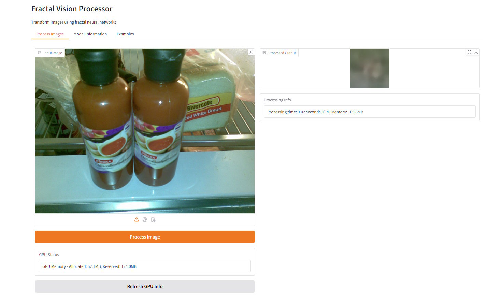

# Fractal Vision - README

(written by chatgpt, ignore the hype. I dunno what the heck is going on in the image fractal brain)



### **Disclaimer**:  
This project is an experimental work-in-progress and **sort of works** with image processing. Expect some odd behaviors and limitations. It **only** works with certain image formats like `.jpg` and the **webcam screenshot taker currently does not work**.

## Introduction  
**Fractal Vision** is an extension of the **Fractal Brain** project. While Fractal Brain is designed to process text and language with an advanced neuron architecture inspired by biological systems, Fractal Vision applies these ideas to **visual inputs**, processing and transforming images using a recursive neural architecture (fractal neurons). This system explores how a "fractal brain" might interpret and manipulate visual data, acting as an experimental AI capable of handling image-based inputs.

The purpose is to tie visual input processing with the conceptual work of the Fractal Brain, showing how they might function together. However, the current implementation is experimental and incomplete. The idea was to integrate visual image processing with neural models capable of recursive learning and dynamic structural changes. But please keep in mind that this project might not be fully functional in the way intended.

## Features  
- **Image Variational Autoencoder (VAE)**: Encodes and decodes images, compressing them into a latent representation.
- **Fractal Neuron Architecture for Vision**: Processes images recursively, inspired by brain-like fractal networks.
- **Spatial Attention Mechanism**: Focuses on important regions in the input image.
- **GPU Optimizations**: Uses mixed precision training (if CUDA is available) for better performance on GPUs.
- **Gradio Interface**: Provides an interactive web interface to process images and experiment with the model.

## Table of Contents  
- [Introduction](#introduction)  
- [Features](#features)  
- [Architecture Overview](#architecture-overview)  
- [Installation](#installation)  
- [Usage](#usage)  
- [Limitations](#limitations)  
- [Acknowledgments](#acknowledgments)

## Architecture Overview  
Fractal Vision is based on a recursive, fractal neuron architecture originally designed for **Fractal Brain**. Here's an overview of the visual processing flow:
1. **Input**: Images are fed into the model.
2. **VAE Encoding**: The image is encoded into a latent vector representation.
3. **Fractal Processing**: The fractal neuron architecture processes the latent vector recursively, applying a hierarchy of transformations.
4. **VAE Decoding**: The processed latent vector is decoded back into an image.
5. **Spatial Attention**: The model uses a spatial attention mechanism to focus on specific parts of the image during processing.

## Installation  
### Prerequisites:  
- **Python 3.7** or higher  
- **PyTorch** (with CUDA support if using GPU)  
- **Gradio** for the web interface  

### Steps:  
1. **Clone the repository**:  
    ```bash
    git clone https://github.com/anttiluode/fractalvision.git
    cd fractal-vision
    ```

2. **Create a virtual environment** (optional but recommended):  
    ```bash
    python -m venv venv
    source venv/bin/activate  # On Windows use `venv\Scripts\activate`
    ```

3. **Install dependencies**:  
    ```bash
    pip install -r requirements.txt
    ```

4. **CUDA Setup** (optional but recommended if you have a GPU):  
    If you're using CUDA, make sure it's properly installed, and PyTorch is configured for GPU.  

## Usage  
1. **Run the main script** to start the Gradio interface:  
    ```bash
    python fractal_vision.py
    ```

2. **Gradio Interface**:  
    - **Input Image**: Upload an image in supported formats (`.jpg` works best).  
    - **Process Image**: Click the "Process Image" button to apply the fractal neuron processing.  
    - **Output**: The processed image will be displayed on the right with a log of processing time and GPU memory usage (if applicable).

## Limitations  
- **Limited Format Support**: Only certain image formats (like `.jpg`) are supported. Other formats might not work as expected.
- **Webcam Taker Not Functional**: The webcam feature is non-functional at the moment, so screenshots from the webcam cannot be processed.
- **Experimental**: The fractal neuron model for vision is highly experimental, and results may not always make sense.
- **Computationally Expensive**: This model is heavy on resources and requires a capable machine, preferably with a GPU for reasonable performance.

## Acknowledgments  
This project was inspired by the concepts of **Fractal Brain** and builds upon the idea of recursive neuron networks. Special thanks to the open-source community for tools like **PyTorch**, **Gradio**, and **Hugging Face** libraries.
